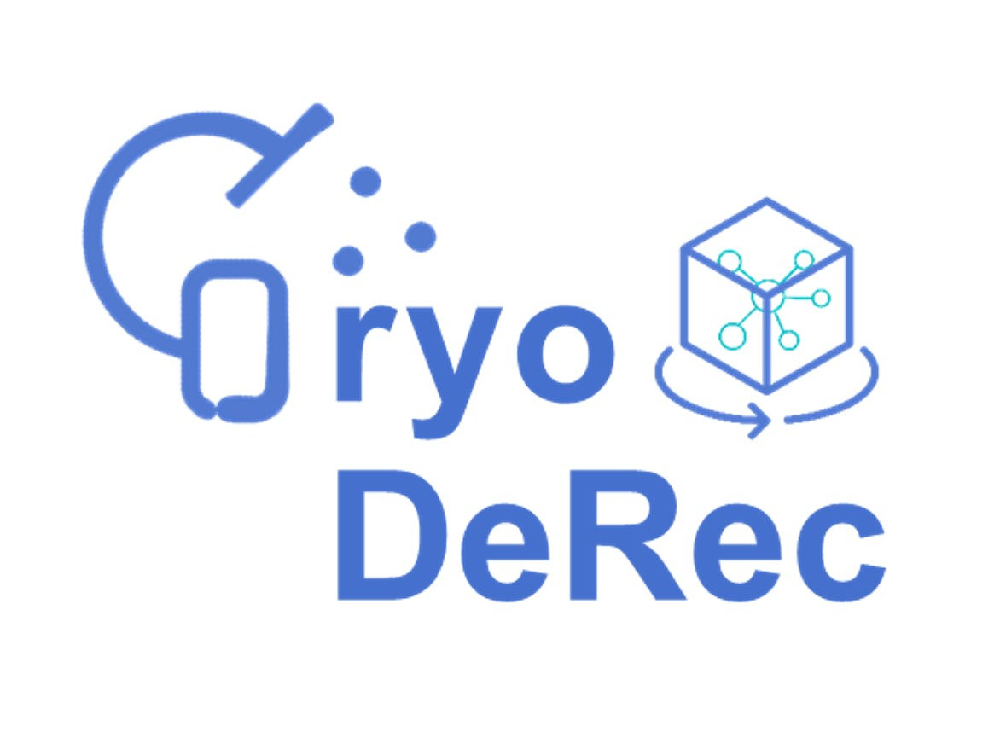

# CryoDeRec

Official implementation of the paper: A supervised multi-task framework for joint cryo-ET restoration enabled by generative physical simulation. Accepted by CVPR 2026 (main conference).


## Introduction

Cryo-electron tomography (cryo-ET) is a dominant imaging technique for visualizing biological structures in situ. However, the low signal-to-noise ratio (SNR) and anisotropic resolution arising from the low-dose electron imaging and missing-wedge reconstructions severely influence the quality of cryo-electron tomograms. The performance of computational methods for high-quality cryo-ET reconstruction is limited due to the lack of prior knowledge of noise modeling and ground truth information. In this work, we propose a learning-based joint denoising and missing-wedge reconstruction method called cryoDeRec. The proposed cryoDeRec is implemented based on a reliable simulated training dataset containing biological structures and noise patterns via physical imaging simulation using a generative model. This work has demonstrated that if the model is trained with a simulated dataset containing extensive knowledge of realistic noise and isotropic structural information, such a model will be capable of restoring realistic data directly. 


---

## 1. Environment

We recommend using the provided conda environment:

```bash
cd CryoDeRec
conda env create -f cryoDeRec_env.yaml
conda activate cryoDeRec
```

---

## 2. Data and Pre-trained Models

To simplify usage and allow you to skip the simulation stages, we provide pre-simulated training datasets, noise patches, and pre-trained CryoDeRec models. 

### Download Links
You can download all necessary data and model weights from either of the following platforms:
* **Google Drive**: [Link to Google Drive](https://drive.google.com/drive/folders/1hKsn2aQuys2m8eEtd9l8aLVpmJQo8qG2) 
* **Baidu Netdisk**: [Link to Baidu Netdisk](https://pan.baidu.com/s/1r5YfF7zgyKYQ-bkglQYJZA?pwd=x72n) 

### Directory Placement
After downloading, please extract and organize the files into your project directory. Please refer to the provided `data_model_tree.txt` for the expected directory structure.


With these files correctly placed, you can:
1. Skip Stage 1 and Stage 2, and go directly to Stage 3 to train or test CryoDeRec.
2. Directly run inference on real tomograms using the provided pre-trained models.

---

## 3. End-to-End Pipeline Overview

The full pipeline is split into three main stages:

1. **Tomogram simulation**  
   Script: `CryoDeRec/tomogram_simulation/pipeline_tomo_simu.sh`

2. **Noise modeling and noisy tomogram generation**  
   - Noise patch generation: `CryoDeRec/noise_modeling/noise_synthesizer/train_Sim_GenNoise.sh`  
   - CTF + noise + reconstruction: `CryoDeRec/noise_modeling/pipeline_noise_modeling.sh`

3. **CryoDeRec training and inference**  
   Script: `CryoDeRec/training/train_and_test.sh`

Below we describe each stage in detail.

---

## 4. Stage 1 – Tomogram Simulation (`tomogram_simulation`)

### 4.1 Running the simulation pipeline

From the project root:

```bash
cd CryoDeRec/tomogram_simulation
bash pipeline_tomo_simu.sh
```


### 4.2 Choosing the macromolecular structure

The simulated cellular context is controlled by the protein configuration in `step1_all_features_of_proteins.py`, in particular:

- `PROTEINS_LIST` (pointing to `.pns` files describing macromolecular density volumes)

To adapt the simulation to a specific real dataset, you should:

- Prepare `.pns` entries based on the real macromolecular structures (e.g. EMDB maps),
- Update `PROTEINS_LIST` / related parameters in `step1_all_features_of_proteins.py`.

The philosophy and configuration style follow **PolNet** ([polnet GitHub](https://github.com/anmartinezs/polnet)), which can be used as detailed reference for structural modeling.

### 4.3 Key outputs of the simulation

After `pipeline_tomo_simu.sh` finishes, the important tomograms are:

- **Clean tomogram (Ground Truth)**
  - `CryoDeRec/tomogram_simulation/data_generated/polnet_test_20260304_emd11999_bin8_1024/tomos/tomo_rec_refined_tilt-90to90step1.mrc`

- **Tilt-series-based tomogram used for the noise step**
  - `CryoDeRec/tomogram_simulation/data_generated/polnet_test_20260304_emd11999_bin8_1024/tomos/tomo_mics_refined_tilt-60to62step3.mrc`
  - This volume will be used as input for the noise modeling pipeline in Stage 2.

---

## 5. Stage 2 – Noise Modeling and Noisy Tomogram Generation

Stage 2 has two parts:

1. Generate realistic noise patches with a GAN.
2. Apply CTF and noise to the tilt series and reconstruct a noisy tomogram.

### 5.1 Noise patch generation (`noise_synthesizer`)

From the project root:

```bash
cd CryoDeRec/noise_modeling/noise_synthesizer
bash train_Sim_GenNoise.sh
```

The **inference** part of `train_Sim_GenNoise.sh` is:

```bash
python crSim_generate_noise_with_GAN.py \
       --model WGAN-GP \
       --is_train False \
       --dataset custom \
       --load_D ./pre_trained/discriminator.pkl \
       --load_G ./pre_trained/generator.pkl \
       --cuda True \
       --batch_size 128 \
       --tilt_angles 41 \
       --patch_size 256 \
       --image_size 1024 \
       --save_path ./synthesized_noise_output
```

**Parameter explanation:**

- `--model WGAN-GP`: use a WGAN with gradient penalty for noise synthesis.
- `--is_train False`: inference mode only (no training), generator/discriminator weights are loaded from `--load_G/--load_D`.
- `--dataset custom`: use a custom dataset definition (during training, this points to real-noise patches).
- `--load_D`, `--load_G`: paths to pre-trained discriminator and generator (provided in `pre_trained/`).
- `--cuda True`: enable GPU inference.
- `--batch_size 128`: number of noise patches per generation batch.
- `--tilt_angles 41`: number of tilts to synthesize (e.g. from -60° to 60° in steps of 3°, giving 41 tilts).
- `--patch_size 256`: side length of each noise patch (256×256).
- `--image_size 1024`: final noise images are 1024×1024, assembled from patches.
- `--save_path`: output directory for the synthesized noise volume.

The result is a noise volume such as:

- `./synthesized_noise_output/noise_tilts_1024_1024_41.mrc`

This has shape `1024 × 1024 × 41` and will be used to inject noise into the tilt series in the next step.

> We also provide a ready-to-use noise patch file `noise_tilts_1024_1024_41.mrc` that you can use directly without re-running the GAN.

### 5.2 CTF + noise + reconstruction (`pipeline_noise_modeling.sh`)

From the project root:

```bash
cd CryoDeRec/noise_modeling
bash pipeline_noise_modeling.sh
```

This script uses:

- The **tilt-series tomogram** from Stage 1:  
  `tomo_mics_refined_tilt-60to62step3.mrc`
- The **noise volume** from 4.1:  
  `noise_tilts_1024_1024_41.mrc`


This `final_tomogram_m_0.3_rotx.mrc` will be used as the **noisy training input** in Stage 3.

---

## 6. Stage 3 – CryoDeRec Training and Inference (`training`)

### 6.1 Organizing training data

We train CryoDeRec using paired (noisy, clean) tomograms:

1. **Clean tomogram (ground truth)**  
   - Take from Stage 1:  
     `tomo_rec_refined_tilt-90to90step1.mrc`  
   - Copy/move to:
     ```text
     CryoDeRec/training/training_simulated_data/empiar_10499/train_sim_gt/tomo1.mrc
     ```

2. **Noisy tomogram (input)**  
   - Take from Stage 2:  
     `final_tomogram_m_0.3_rotx.mrc`  
   - Copy/move to:
     ```text
     CryoDeRec/training/training_simulated_data/empiar_10499/train_noisy/tomo1.mrc
     ```

You can add more pairs `tomo2.mrc`, `tomo3.mrc`, etc., following the same naming convention to increase dataset size.

### 6.2 Training (`train_and_test.sh`)

From the project root:

```bash
cd CryoDeRec/training
bash train_and_test.sh
```

The training command inside `train_and_test.sh` typically looks like:

```bash
CUDA_VISIBLE_DEVICES=1 python denoise3d_missingRec.py \
    --save-prefix ./model_training/empiar_10499/cryoderec_model \
    --save-interval 25 \
    --N-train 270 \
    --N-test 50 \
    -a ./training_simulated_data/empiar_10499/train_noisy \
    -b ./training_simulated_data/empiar_10499/train_sim_gt \
    -c 96 \
    -mw 60 \
    --criteria L2 \
    -p 32 \
    -o ./test_results \
    --num-epochs 200 \
    --num-workers 8 \
    -d -2 \
    --batch-size 2 \
    --masked-loss-weight 0.1
```

Important arguments:

- `-a`, `-b`: paths to noisy and clean training volumes.
- `-mw`: missing wedge angle (e.g. 60°).
- `--masked-loss-weight`: weight of the loss inside the missing wedge.

### 6.3 Inference (`train_and_test.sh`)

The same script also contains an inference command, for example:

```bash
CUDA_VISIBLE_DEVICES=2 python denoise3d_missingRec.py \
   -o ./test_results/empiar_10499_pretrain_m0.5  \
   -m ./model_training/empiar_10499/cryoderec_model_best.sav \
   -s 96 \
   -d -2 \
   --patch-padding 32 \
   --batch-size 1 \
   ./test_data/EM10499_TS05.mrc
```

Notes:

- `-m`: path to the saved model for inference (e.g. `cryoderec_model_best.sav`).
- `-o`: output directory for denoised volumes.

---

## 7. Ready-to-use Simulated and Real Data

To simplify usage, we also provide:

- A set of **pre-simulated training data** (noisy + clean tomograms) under:
  - `CryoDeRec/training/training_simulated_data/...`
- A tested **noise patch volume**:
  - `CryoDeRec/noise_modeling/noise_synthesizer/synthesized_noise_output/noise_tilts_1024_1024_41.mrc`
- (Optionally) real EMPIAR tomograms for direct evaluation (you can add links here when you publish).

With these, you can:

1. Skip Stage 1 and Stage 2, and go directly to Stage 3 to train or test CryoDeRec.
2. Or directly run inference on real tomograms using the provided pre-trained model.

---

## 8. Acknowledgements

- **PolNet** – Python package for generating synthetic datasets of the cellular context for cryo-electron tomography  
  GitHub: [https://github.com/anmartinezs/polnet](https://github.com/anmartinezs/polnet)  
  The simulation part of CryoDeRec is heavily inspired by and partially based on PolNet’s design, configuration, and data structures.

- **Topaz** – Particle picking and denoising for cryo-EM  
  GitHub: [https://github.com/tbepler/topaz](https://github.com/tbepler/topaz)  
  The 3D denoising network and training pipeline in CryoDeRec builds upon and extends Topaz’s denoising modules.

We thank the authors of PolNet and Topaz for making their code and ideas available to the community.

